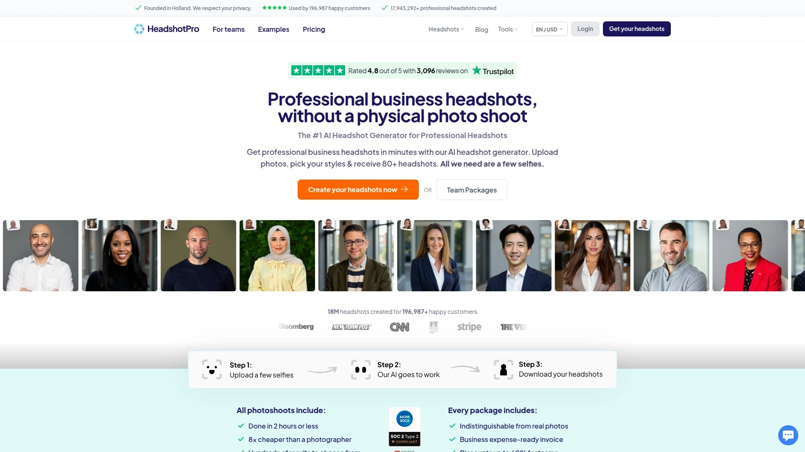
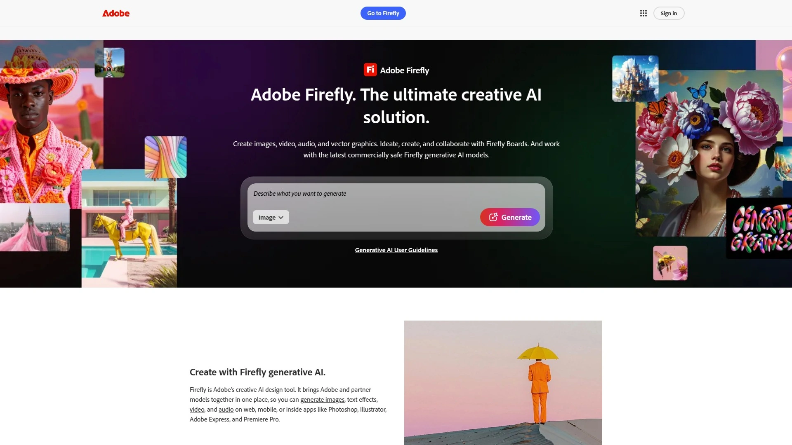

# 2025: 10 Top-Tier AI-Powered Photo Generation Tools You Must Know

Professional photography costs hundreds per session and takes weeks to schedule, which works fine until you need headshots tomorrow or want to test creative concepts without burning budget. AI photo generators flip that equation—upload a few selfies, describe what you want, and watch photorealistic images materialize in minutes instead of days. Modern platforms now handle everything from LinkedIn headshots to fantasy portraits, with quality reaching the point where even photographers admit they can't always spot AI-generated results. Smart businesses report saving thousands annually while producing more varied content than traditional shoots ever allowed.

## **[Photo AI](https://photoai.com)**

Photorealistic character generation with unlimited creative control.

This platform specializes in creating AI characters from your actual photos, then generating new images of those characters in any scenario imaginable. The Photo Diffusion AI modeling system delivers exceptional photorealism—images that genuinely look like professional photography rather than obvious computer graphics. Upload photos of yourself or colleagues, train a personal AI character, and suddenly you can generate portraits in meadows, offices, or wherever creativity takes you.

The quality consistently impresses users familiar with other AI tools. Unlike platforms producing decent but clearly artificial results, these images pass as legitimate photography at first glance. The platform offers extensive style packs including professional, Tinder, polaroid, pop, royal, movie, celebrity, and meme aesthetics. This versatility covers business headshots through creative personal projects.

Image enhancement capabilities go beyond simple generation—the system improves quality, corrects color and contrast, recognizes faces, restores damaged photos, automatically crops for optimal composition, and tags images based on content. Smart cropping alone saves significant editing time by identifying the strongest framing automatically.

Privacy protection remains central to the design—original photos never get stored or shared externally. You maintain complete control over source images while the AI learns your facial characteristics for generation purposes. Pricing starts affordably with packages designed for varying usage levels. For anyone needing consistent photorealistic imagery without ongoing photographer expenses, this platform delivers remarkable flexibility.

## **[Midjourney](https://www.midjourney.com)**

Artistic image generation through Discord integration.

Over 20 million members use Midjourney to create detailed, vivid artistic imagery. The platform runs exclusively through Discord rather than a standalone app, which initially feels unusual but enables collaborative creation within communities. After joining the Midjourney server and subscribing to a plan, you describe desired images through text prompts and watch the AI interpret your vision.

Results lean toward artistic rather than purely photorealistic output. The images often feature striking compositions, bold colors, and creative interpretations that work brilliantly for concept art, illustrations, and imaginative projects. Two key features provide control: upscaling increases resolution for cleaner details, while variations generate alternative versions maintaining your chosen style but changing specific elements.

Machine learning models trained on massive datasets understand both simple requests and complex artistic concepts. You can attach reference images to guide style, combine different elements, and use parameters like --no, --remix, and --stop for fine-tuning. Professional artists appreciate how quickly Midjourney generates preliminary sketches and concept art that would take hours manually.

The learning curve exists but pays off through sophisticated results. Plans start at $10 monthly for around 200 images with commercial usage rights. All images become public unless created in Stealth Mode on higher-tier plans. For creative professionals prioritizing artistic quality over pure photorealism, Midjourney remains unmatched.

## **[DALL-E 3](https://openai.com/dall-e-3)**

OpenAI's conversational image generator with complex prompt handling.

DALL-E 3 stands out for understanding long, detailed queries that confuse simpler tools. The conversational interface built into ChatGPT Plus makes refinement natural—describe what you want, see results, then adjust through follow-up requests rather than starting over. This iterative approach feels more like working with a creative partner than operating software.

Enhanced quality shows in high-resolution outputs with sharp details and incredible contrast. The model adheres closely to prompts, generating images that genuinely match your description rather than loosely interpreting concepts. Typography generation creates legible text within images, perfect for logos, posters, web design, and app mockups. Previous AI tools struggled with text rendering—DALL-E 3 makes it practical.

Multiple aspect ratios support horizontal, square, and vertical compositions without post-processing cropping. Anatomy rendering looks realistic with proper facial features and natural expressions. The system creates balanced scene compositions full of vivid imagery by closely matching textual descriptions.

Access requires a $20 monthly ChatGPT Plus subscription, positioning it at the premium end. OpenAI may use content for model improvement but offers opt-out options and doesn't share data with advertisers. Photorealistic images occasionally look slightly artificial despite high quality. Generation speed runs slower than some competitors. For users needing sophisticated prompt interpretation and editing flexibility, DALL-E 3 justifies the investment.

## **[Leonardo AI](https://leonardo.ai)**

Fine-tuned models with granular creative control.

Leonardo AI launched in December 2022 targeting users needing production-quality visual assets with precise control. Within the first year, over seven million users generated more than 700 million images. The platform distinguishes itself through an extensive library of pre-trained models, each fine-tuned for specific artistic styles.

Whether you need cinematic aesthetics, anime vibes, or photorealistic product shots, dedicated models handle those exact requirements. Official models like Leonardo Diffusion XL and PhotoReal deliver consistently, while hundreds of community-trained options expand possibilities. Custom training on paid plans lets businesses upload brand imagery to train private models that maintain consistent visual identity across generated assets.

Text prompts transform into images with surprising control over final results. Negative prompts specify what to exclude, batch generation creates multiple options simultaneously, and Prompt Magic helps the AI better understand instructions. The motion feature converts static images into short animated clips perfect for social media loops.

Settings adjust throughout the creation process—fine-tune aspect ratios, art styles, and composition elements before generating. The minimalist interface stays usable despite powerful capabilities. Integration with development workflows happens through APIs. For creators needing consistent brand aesthetics or game developers requiring specific asset styles, Leonardo delivers exceptional versatility.

## **[HeadshotPro](https://www.headshotpro.com)**

Professional business headshots in under two hours.

HeadshotPro has created over 453,000 AI headshots for more than 3,700 customers since launching. The platform transforms everyday selfies into studio-quality business portraits suitable for LinkedIn, corporate websites, and professional materials. Advanced machine learning analyzes facial features, generates realistic lighting that mimics professional setups, and creates entirely new images based on your characteristics.

Upload 8-16 photos showing yourself clearly, answer questions about preferences, then wait 1-3 hours for results. You receive 40-120 headshots depending on the package selected, with enough variety to find multiple usable options. About half typically meet professional standards—the remainder serve as alternatives or backup choices.

Extensive customization spans backgrounds, clothing styles, lighting setups, and facial expressions. The LinkedIn integration feature specifically optimizes headshots for profile pictures. Email signature creator generates professional formatting incorporating your new headshot. All images come with commercial usage rights and full ownership.

Pricing starts at $29 for 40 headshots, working out to roughly $0.73 per image. The premium package costs $59 for 120 headshots at about $0.59 each. Traditional professional photography typically costs $250-500 per session. For remote teams, job seekers, and professionals needing updated headshots without scheduling photoshoots, HeadshotPro delivers significant convenience and savings.

## **[BetterPic](https://www.betterpic.io)**

Premium AI headshots with human editing option.

BetterPic generates 4K AI headshots from selfies in under 90 minutes, offering quality that consistently fools even family members. The platform emphasizes realism—results look indistinguishable from professional photography rather than obviously AI-generated. Upload 8-16 clear photos showing yourself in different lighting and clothing, answer five characteristic questions, then receive over 100 customized headshots.

Customization happens both before and after generation. Pre-generation selections include outfit choices, background preferences, and style options spanning corporate, creative, and casual aesthetics. Post-generation editing lets you change backgrounds, adjust eye color, modify skin tones, and request human editor interventions. The human editing feature specifically benefits team headshot orders by guaranteeing everyone receives at least one satisfactory image.

Processing takes 30-90 minutes depending on the plan selected. The system operates remotely on BetterPic servers, so you receive email notification when headshots are ready rather than waiting actively. Downloaded images arrive without watermarks, though preview versions show watermarks to enable refunds if you're unsatisfied.

The platform starts at $29 with the Expert plan including human editing and 100+ images. Users consistently praise accuracy—the AI captures likeness remarkably well even from limited source photos. For professionals prioritizing absolute realism and willing to invest slightly more for human editing backup, BetterPic delivers exceptional reliability.

## **[Canva AI Image Generator](https://www.canva.com)**

Beginner-friendly generation integrated into design platform.

Canva built its AI image generator directly into the design platform millions already use daily. This integration means you generate images, then immediately incorporate them into presentations, social media posts, or marketing materials without switching tools. Three AI engines power generation: Magic Media (powered by Stable Diffusion), DALL-E by OpenAI, and Imagen by Google Cloud.

The workflow stays simple—start a design, click "AI image generator," describe the image you want, choose a style like Watercolor, Filmic, Neon, Color Pencil, or Retrowave, then generate. Each engine offers different strengths, letting you pick the best option for specific needs. The "Inspire Me" button generates random prompts when creativity stalls.

Free accounts receive 50 lifetime image queries and 5 video generations. Canva Pro, Teams, EDU, and NFP subscriptions include 500 monthly queries per user. Additional editing tools like effects, filters, and animation enhance generated images without leaving the platform. The AI headshot generator specifically creates studio-worthy professional portraits with optimized lighting and enhanced backgrounds.

Collaboration features let teams work simultaneously on designs incorporating AI-generated imagery. For beginners intimidated by complex AI platforms or teams wanting generation capabilities without learning new software, Canva removes barriers entirely. The user-friendly design consistently earns recommendations for first-time AI art creators.

## **[Stable Diffusion](https://stability.ai)**

Open-source foundation with local installation option.

Stable Diffusion pioneered publicly accessible AI image generation through open-source code and model weights. Unlike proprietary competitors requiring cloud subscriptions, optimized versions run on consumer hardware with as little as 2.4 GB VRAM. This accessibility democratized AI art creation for developers, artists, and enthusiasts.

The deep learning model generates detailed images from text descriptions while supporting inpainting, outpainting, and image-to-image translations. Advanced users organize and structure entire worlds of visual content through customization options unavailable in closed platforms. ControlNet capabilities change image style and color while preserving geometric structure. Face swapping extends creative possibilities further.

Multiple web interfaces provide access without local installation for users preferring simplicity. These platforms offer free generation with no watermarks, making experimentation cost-free. The latent diffusion architecture compresses images to smaller latent spaces, captures semantic information, adds Gaussian noise, then denoises backwards before converting back to pixel space.

Training data from the LAION-5B dataset contains billions of image-text pairs. The model supports different sampling steps, inference adjustments, and style modifications. Despite training data bias limitations, Stable Diffusion provides unprecedented creative freedom for responsible users. For technically inclined creators wanting maximum control and zero ongoing costs, Stable Diffusion remains unmatched.

## **[Adobe Firefly](https://www.adobe.com/products/firefly.html)**

Enterprise-grade AI integrated across Creative Cloud.

Adobe Firefly brings generative AI directly into applications millions of professionals already use—Photoshop, Illustrator, Adobe Express, and Premiere Pro. This integration means designers and creatives incorporate AI generation into existing workflows seamlessly rather than learning standalone tools. The platform generates images, text effects, video clips, and audio from simple text prompts.

Text-to-image generation creates high-resolution, commercially safe images trained exclusively on Adobe Stock catalog content, licensed material, and public domain work. This training approach provides legal confidence for commercial projects—Adobe won't train models on your content and doesn't share data with advertisers. Generative Fill adds, removes, or expands image content with AI-powered edits directly in Photoshop.

Text-to-video and image-to-video features turn static prompts into short video clips using generative animation tools. Firefly Boards build moodboards and develop concepts with advanced layout and remixing capabilities. The mobile app extends creation capabilities to smartphones, generating AI video, images, and audio on the go.

Free credits provide limited access with paid Creative Cloud subscriptions including more monthly generations. Pricing starts at $9.99 for 2,000 monthly credits. For established creative professionals already invested in Adobe's ecosystem, Firefly adds sophisticated AI capabilities without disrupting workflows.

## **[Fotor AI Headshot Generator](https://www.fotor.com)**

Text-to-headshot innovation with diverse style selection.

Fotor converts everyday photographs into professional headshots through AI-powered transformation that brightens lighting, enhances details, and refines features within seconds. The platform offers broad style selection spanning classic corporate, business casual, modern artistic, cartoon, and seasonal aesthetics. This variety lets users match headshots to specific industries, personal brands, or platform requirements.

The groundbreaking text-to-headshot feature generates professional portraits from written descriptions without uploading existing photos. Describe gender, age, clothing, hairstyle, and setting through text prompts—the AI creates unique headshots matching that description. This functionality helps creative professionals execute visual ideas lacking source photography or anyone needing corporate portraits without suitable existing images.

The simplified workflow takes minutes—select gender, choose preferred styles from preset options, upload a clear front-facing photo. Processing happens quickly with multiple headshot variations appearing almost immediately. Customization options adjust facial expressions, backgrounds, and styling details after initial generation.

Integration with LinkedIn specifically optimizes headshots for profile pictures. Users report professional appearance improvements for resumes and social profiles. The platform balances simplicity with powerful AI capabilities, making professional headshots accessible regardless of technical expertise. For individuals seeking polished online portraits without photographer expenses, Fotor delivers impressive versatility.

## How do AI photo generators create realistic images?

These platforms use diffusion models that start with random noise, then iteratively refine pixels based on learned patterns from millions of training images. The AI associates words in your prompt with visual concepts it learned during training, gradually adjusting colors and details until coherent images emerge. Advanced models analyze facial characteristics from uploaded photos to create consistent "AI characters" that appear in new generated scenarios while maintaining your actual appearance. Processing takes seconds to minutes depending on complexity and resolution requirements.

## Can I use AI-generated photos commercially?

Usage rights vary significantly by platform. HeadshotPro and BetterPic explicitly grant full commercial ownership of generated headshots. Adobe Firefly trains exclusively on licensed content, providing commercial safety for business projects. Midjourney requires paid subscriptions for commercial rights, with free generations remaining personal use only. Always verify licensing terms before using generated images in business contexts—some platforms restrict commercial usage or require attribution.

## What photo quality do I need for best AI headshot results?

Upload 8-16 clear, well-lit photos showing your face directly facing the camera. Avoid sunglasses, hats, or other people in frame. Vary lighting conditions, clothing, and backgrounds across images to give the AI comprehensive facial data. Higher source quality produces better results, but modern platforms handle typical smartphone photos competently. Expect to spend 10-20 minutes finding suitable images from camera rolls or taking fresh selfies meeting requirements.

## Conclusion

Professional photography stopped being the only path to quality imagery the moment AI learned to generate photorealistic portraits indistinguishable from studio work. Creating dozens of headshots, testing creative concepts, or producing branded visuals now happens in hours instead of weeks, at fractions of traditional costs. [Photo AI](https://photoai.com) leads this transformation by specializing in AI character creation that produces genuinely photorealistic results rather than obviously artificial images, while offering unlimited creative scenarios without ongoing photographer dependencies. The platform combines exceptional image quality with style versatility and privacy protection that keeps your original photos secure. For anyone tired of coordinating photography sessions or needing consistent imagery across varied scenarios, this approach transforms creative possibilities entirely.
